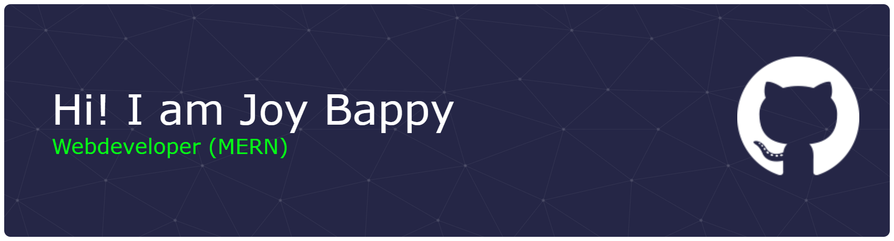

<!-- Banner -->

  

<h1 align="center">Joy Bappy 👋</h1>

  MERN Stack Developer • CS Student @ Nasir Polytechnic Institute • Bangladesh 🇧🇩

---

## 👨‍💻 About Me

I’m **Joy Bappy**, a passionate **Web Developer (MERN)** and Computer Science student at **Nasir Polytechnic Institute**.  
I enjoy building **user-friendly, minimal web applications**, where **user experience matters more than heavy UI design**.

- 🌱 Currently exploring **Next.js**
- 🛠️ Working on an **E-Tuition platform**
- 📚 Learning new things every day and improving my fundamentals

---

## 💻 Tech Stack

### 🎨 Frontend

### ⚙️ Backend & Tools

### 🚀 Currently Learning

---

## 📊 GitHub Stats

  

  

  

---

## 🏆 GitHub Trophies

  

---

## 🌐 Connect With Me

---

## 🚀 Featured Projects
> Pin your **top repositories** here from GitHub  
(E-Tuition, MERN apps, React projects, etc.)

---

  

